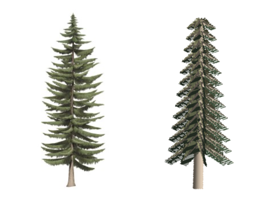

## Modeling with OpenGL

### Contents

- ``OpenGL`` 을 이용해 다양한 물체 모델링

### Order

- [evergreen](https://github.com/happyOBO/ModelingWithOpenGL#evergreen)
- [traffic light](https://github.com/happyOBO/ModelingWithOpenGL#traffic-light)

### evergreen

- 왼쪽 그림을 참고해서 침엽수 모델링

### traffic light

- 신호등 모델링

